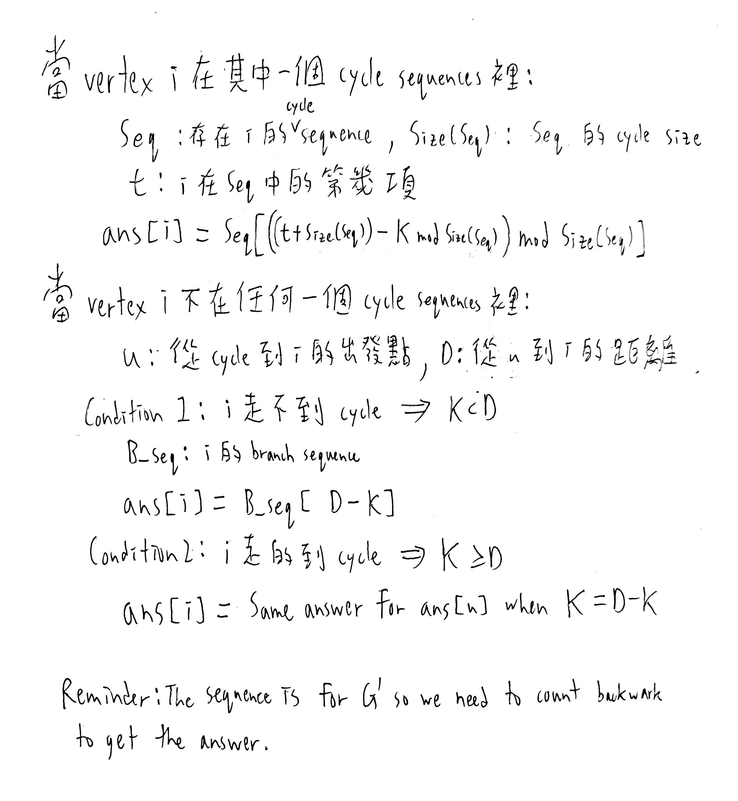
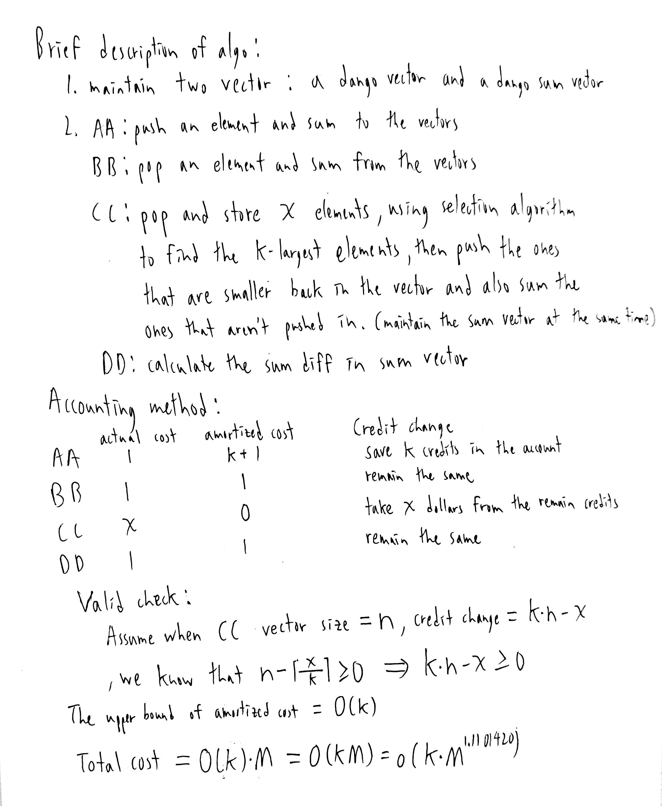
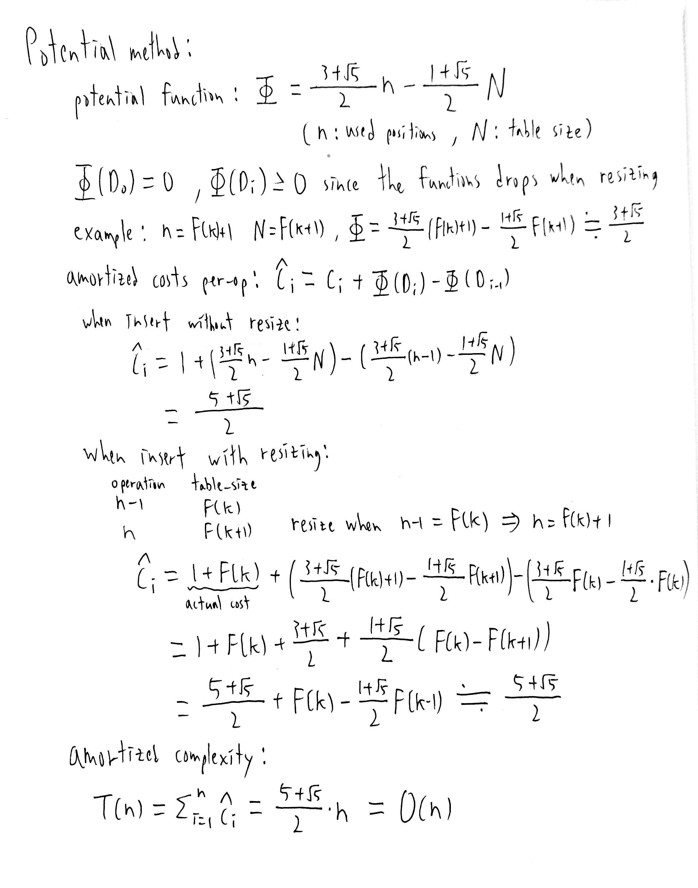
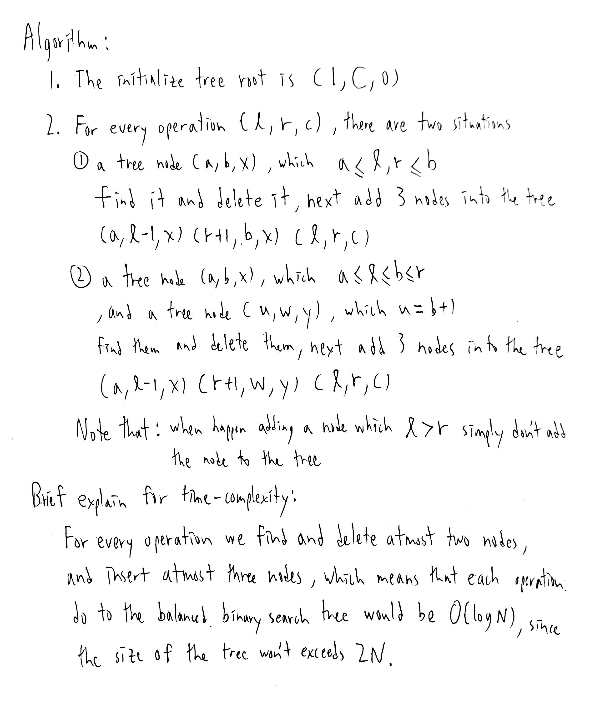
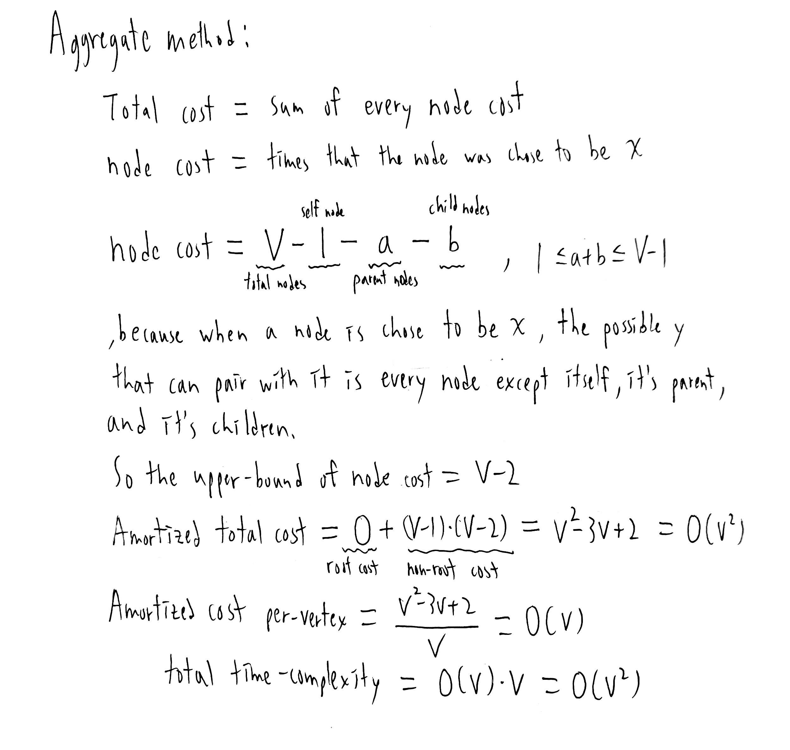

# Homework 3
#### B10902033 林祐辰
 
References: 
Problem 1: B10902032 李沛宸 
Problem 2: B10902032 李沛宸 
Problem 3: B10902032 李沛宸 
Problem 4: B10902032 李沛宸 
Problem 5: B10902032 李沛宸 
Problem 6: B10902032 李沛宸 
 
Problem 5: 
(a) False, counterexample: 
 
 
(b) Ans: R13 Minquan W. Rd., Cost: 45$ 
My method: First I guess that 台北車站 would be the answer, since it looks like the middle of the map. Next I find out that 淡水 has highest fare $50, so I follow the red line to find the answer. Last I find out that there are serveral station around 民權西路 has the same cost to the farthest station which is 45$, so I choose 民權西路 as my answer. 
 
(c) Proof: 
1. Because every node in the graph has exactly one out-degree, so starting from any node -> go to the node it's pointing to -> new node -> go to the node it's pointing to .... This process can go forever, since every node has an out-degree. 
2. Because the sequence above is infinite, and the nodes in the graph are finite. So we can easily find out that there must be a node that appears at least twice in the sequence. (because the sequence > n) 
3. There exist a pointing cycle, since there exist at least two same node in the sequence. 

 
(d) & (e) Algorithm: 
1. Prepare the reverse graph G'. 
2. Traverse G' by DFS to find every cycle, and save their cycle sequence and cycle size. 
3. Run DFS from every vertex in the cycle sequence(don't visit the node on the cycle) 
4. When running 3 save the sequence from the vertex on the cycle to leaf (branch sequence), and their distance (branch distance). 
5. After getting the information we need we can get the answer for every vertex by the method below. 
 
Correctness: The algorithm works by finding the sequence we need and find the answer in O(1). 
Time complexity: Reversing the graph cost O(V + E) = O(2*n) = O(n). Traversing while getting information cost O(n) + O(n) = O(n). Total time complexity = O(n). 

 
(f) & (g) Algorithm: 
1. Find all strongly connected component. 
2. Set the answer of all vertex in SCC infinity, and marked it visited. 
3. Run DFS on the vertex that hasn't been visited, if its child answer is infinity its answer is infinity, else its answer = child answer + 1. 
Correctness: The algorithm works by changing the graph into a DAG which can simplify the question. By running DFS you can get the answer from its child with easy caculate. 
Time complexity: Finding SCC costs O(V + E). Runnig DFS costs O(V + E). Total time complexity = O(V + E). 

 
Problem 6: 
(a) 

 
(b) 

 
(c) 

 
(d) 
