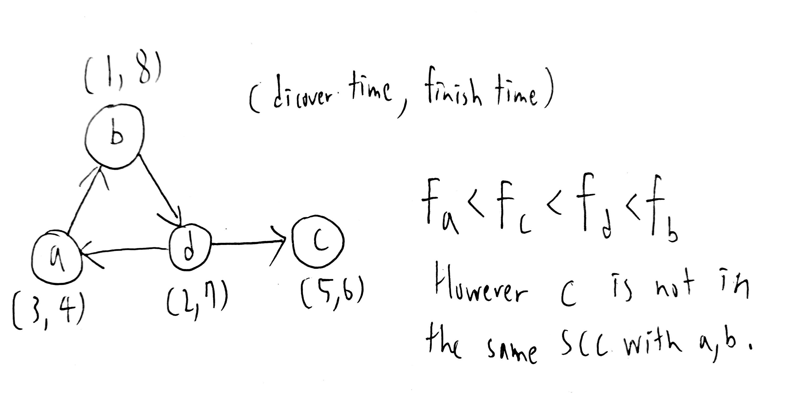

# Homework 3
#### B10902033 林祐辰
 
References: 
Problem 1: B10902032 李沛宸 
Problem 2: B10902032 李沛宸 
Problem 3: B10902032 李沛宸 
Problem 4: B10902032 李沛宸 
Problem 5: B10902032 李沛宸 
Problem 6: B10902032 李沛宸 
 
Problem 5: 
(a) False, counterexample: 
 
(b) Ans: R13 Minquan W. Rd., Cost: 45$ 
My method: First I guess that 台北車站 would be the answer, since it looks like the middle of the map. Next I find out that 淡水 
(c) Proof: 
1. Because every node in the graph has exactly one out-degree, so starting from any node -> go to the node it's pointing to -> new node -> go to the node it's pointing to .... This process can go forever, since every node has an out-degree. 
2. Because the sequence above is infinite, and the nodes in the graph are finite. So we can easily find out that there must be a node that appears at least twice in the sequence. (because the sequence > n) 
3. There exist a pointing cycle, since there exist at least two same node in the sequence. 